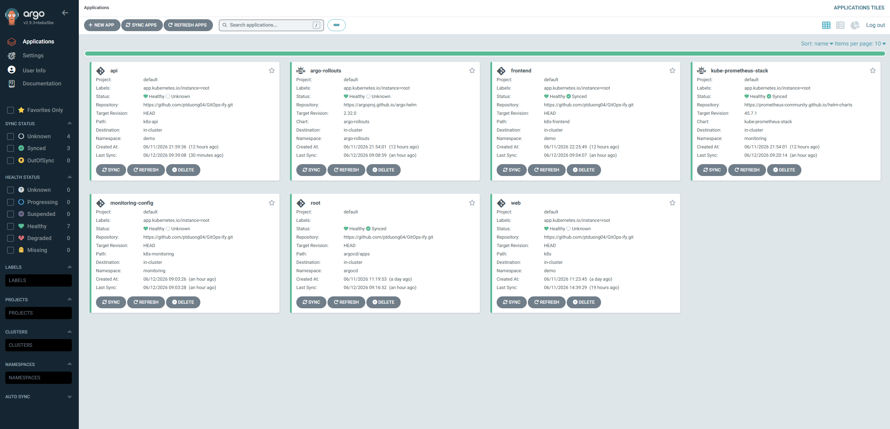
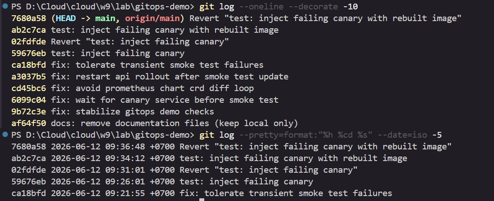
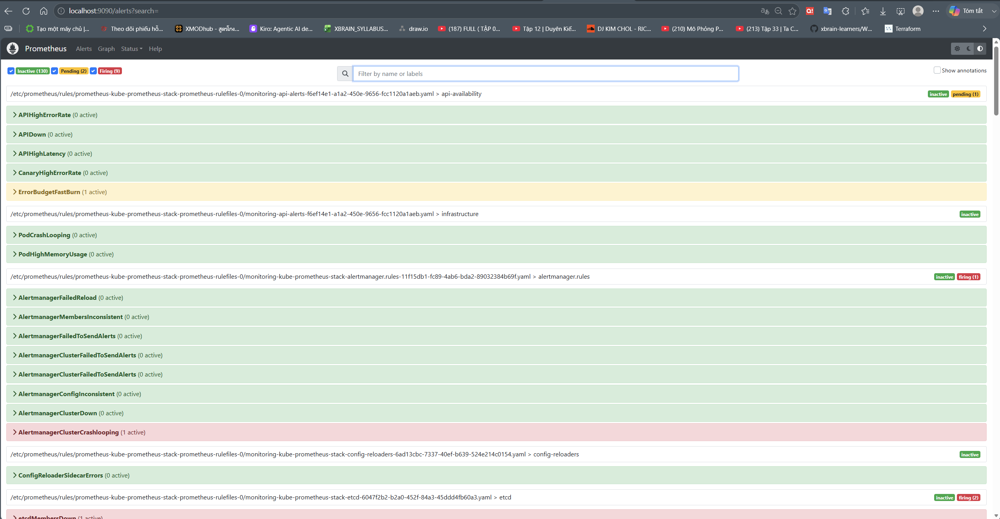
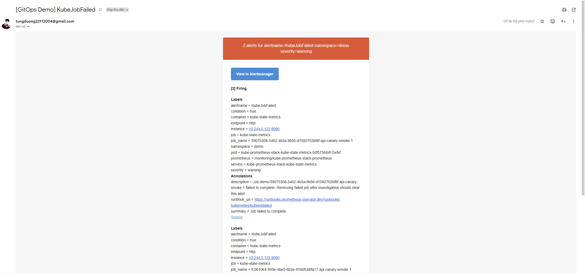
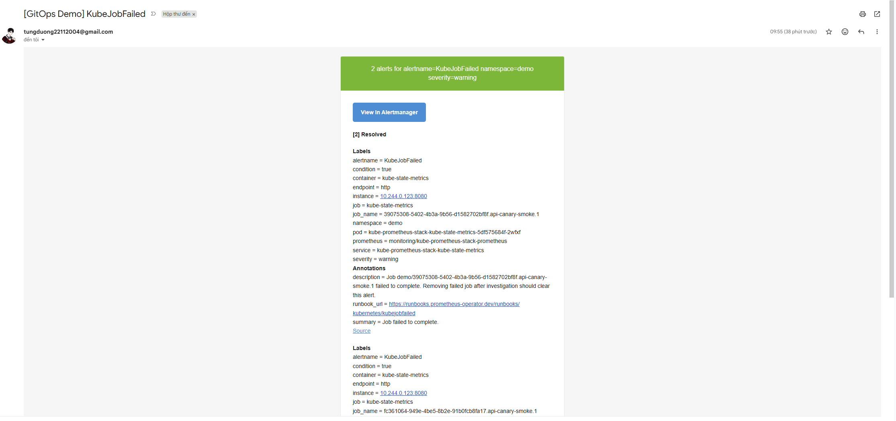
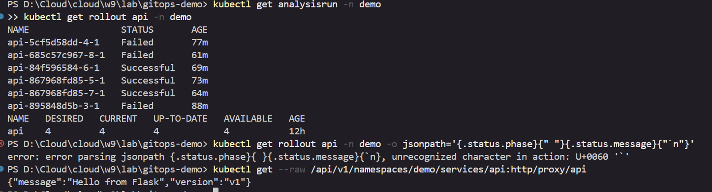
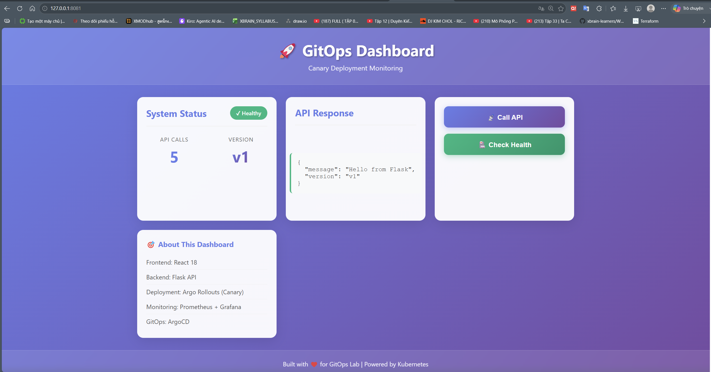
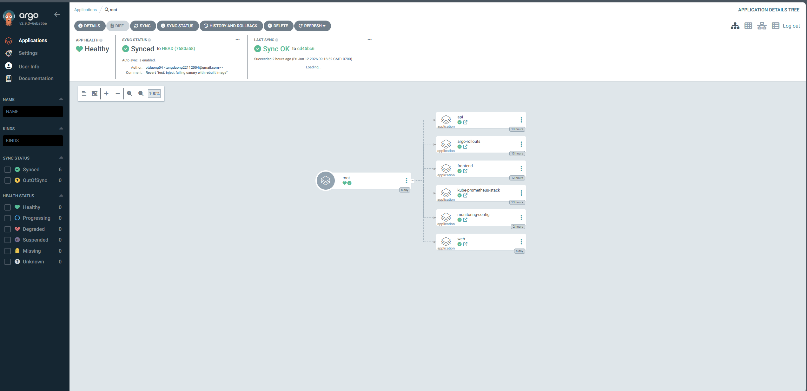

# Evidence GitOps Demo
Họ và Tên : Phạm Tùng Dương / XB-DN26-105

Repo nộp bài: <https://github.com/ptduong04/GitOps-ify/tree/main>

---

## 1. Evidence 1 - Argo CD Synced/Healthy




Trong ảnh, Argo CD đang quản lý các application chính của hệ thống:

- `root`
- `api`
- `frontend`
- `web`
- `monitoring-config`
- `kube-prometheus-stack`
- `argo-rollouts`

Các application đều lấy cấu hình từ Git repository:

```text
https://github.com/ptduong04/GitOps-ify.git
```

Kiểm tra bổ sung bằng CLI sau khi refresh Argo CD:

```text
NAME                    SYNC STATUS   HEALTH STATUS
api                     Synced        Healthy
argo-rollouts           Synced        Healthy
frontend                Synced        Healthy
kube-prometheus-stack   Synced        Healthy
monitoring-config       Synced        Healthy
root                    Synced        Healthy
web                     Synced        Healthy
```

Kết luận: hệ thống được quản lý theo GitOps, desired state nằm trong Git và Argo CD đã đồng bộ về cluster ở trạng thái `Synced/Healthy`.

---

## 2. Evidence 2 - Rollback Bằng Git Revert Dưới 5 Phút




Trong ảnh có 2 commit chính:

```text
7680a58 Revert "test: inject failing canary with rebuilt image"
ab2c7ca test: inject failing canary with rebuilt image
```

Ý nghĩa:

- `ab2c7ca` là commit inject lỗi vào canary.
- `7680a58` là commit rollback bằng `git revert`.
- Commit revert đang là `HEAD -> main, origin/main`, nghĩa là trạng thái rollback đã được push lên GitHub.

Ảnh cũng có log thời gian:

```text
7680a58 2026-06-12 09:36:48 +0700 Revert "test: inject failing canary with rebuilt image"
ab2c7ca 2026-06-12 09:34:12 +0700 test: inject failing canary with rebuilt image
```

Thời gian từ commit lỗi đến commit revert:

```text
09:36:48 - 09:34:12 = 2 phút 36 giây
```

Kết luận: rollback được thực hiện bằng Git, thời gian nhỏ hơn 5 phút.

---

## 3. Evidence 3 - SLO Và Alert Rules Trong Prometheus




Trong ảnh, Prometheus đã load rule từ file rule của monitoring:

```text
monitoring-api-alerts
```

Nhóm rule chính:

```text
api-availability
```

Các alert/SLO rule quan trọng xuất hiện trong ảnh:

- `APIHighErrorRate`
- `APIDown`
- `APIHighLatency`
- `CanaryHighErrorRate`
- `ErrorBudgetFastBurn`

Trong đó `ErrorBudgetFastBurn` đang ở trạng thái pending, chứng minh SLO/error budget rule đã được Prometheus đánh giá.

Kết luận: hệ thống có SLO và alert rule được quản lý qua Git, sau đó được Prometheus load vào runtime.

---

## 4. Evidence 4 - Alert Gửi Về Email Cá Nhân

Alert đang firing trong Gmail:



Alert đã resolved trong Gmail:



Nội dung email thể hiện:

```text
[GitOps Demo] KubeJobFailed
alertname = KubeJobFailed
namespace = demo
job_name = ...api-canary-smoke...
severity = warning
summary = Job failed to complete.
```

Ý nghĩa:

- Khi inject lỗi vào canary, job smoke test của canary bị fail.
- Alertmanager gửi email cảnh báo về Gmail cá nhân.
- Sau khi xử lý/rollback, alert chuyển sang trạng thái resolved.

Kết luận: alert đã fire và gửi về email cá nhân khi có lỗi trong namespace `demo`.

---

## 5. Evidence 5 - Canary Lỗi Tự Abort Và Quay Về Bản Cũ

Argo Rollouts và API response:



Trong ảnh có các bằng chứng chính:

```text
api-5cf5d58dd-4-1    Failed
api-685c57c967-8-1   Failed
api-895848d5b-3-1    Failed
```

Các `AnalysisRun` failed chứng minh canary lỗi đã không được promote.

Rollout hiện tại vẫn đủ số replica:

```text
NAME   DESIRED   CURRENT   UP-TO-DATE   AVAILABLE
api    4         4         4            4
```

API sau rollback trả về bản cũ:

```json
{"message":"Hello from Flask","version":"v1"}
```

Lưu ý: trong ảnh có một dòng lỗi parse `jsonpath` do cú pháp escape trong PowerShell, không phải lỗi rollout. Bằng chứng quan trọng là `AnalysisRun` failed, rollout vẫn available, và service trả về version `v1`.

Kết luận: canary lỗi đã bị abort, hệ thống quay về bản ổn định `v1`.

---

## 6. Evidence Bonus - Build Cả Backend Và Frontend

Phần bonus chứng minh demo không chỉ deploy manifest Kubernetes, mà đã build và chạy được cả frontend lẫn backend sau rollback.

---

### 6.1 Frontend Gọi Được Backend

Dashboard ứng dụng:



Trong ảnh có các bằng chứng chính:

- Frontend đang chạy ở trình duyệt qua địa chỉ local.
- Dashboard hiển thị `System Status: Healthy`.
- Frontend gọi API backend thành công và nhận response:

```json
{
  "message": "Hello from Flask",
  "version": "v1"
}
```

- Mục "About This Dashboard" thể hiện stack của ứng dụng:

```text
Frontend: React 18
Backend: Flask API
Deployment: Argo Rollouts (Canary)
Monitoring: Prometheus + Grafana
GitOps: ArgoCD
```

Ý nghĩa:

- Frontend React đã được build và deploy thành công.
- Backend Flask API đã được build và deploy thành công.
- Frontend gọi được backend qua service trong cluster.
- Sau rollback, backend đang trả về version ổn định `v1`.

---

### 6.2 Argo CD Root App Quản Lý Cả BE Và FE

Root application trong Argo CD:



Trong ảnh, root app đang ở trạng thái:

```text
Healthy
Synced to HEAD (7680a58)
```

Root app quản lý các application con:

- `api`: backend Flask API.
- `frontend`: frontend React.
- `web`: phần web/demo service.
- `argo-rollouts`: controller phục vụ canary deployment.
- `kube-prometheus-stack`: Prometheus/Grafana/Alertmanager.
- `monitoring-config`: rule alert và cấu hình monitoring.

Ý nghĩa:

- Backend và frontend đều được đưa vào cùng flow GitOps.
- Argo CD sync từ Git commit rollback mới nhất `7680a58`.
- Root app theo mô hình app-of-apps giúp quản lý toàn bộ hệ thống, không deploy thủ công từng phần.

Kết luận bonus: demo đã build và chạy đầy đủ cả frontend React và backend Flask API; cả hai đều được quản lý qua Argo CD/GitOps, backend trả về `v1` sau rollback và frontend hiển thị được response từ backend.
